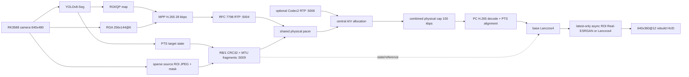
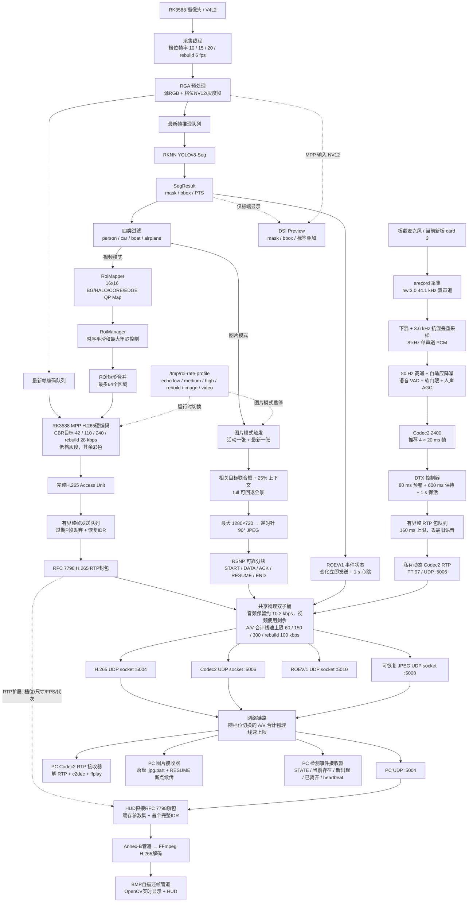

# RK3588 YOLOv8-Seg ROI H.265 sender

## 网络拓扑
```
192.168.0.100 Windows PC 本机：视频 HUD、音频和图片接收端
192.168.0.101 RK3588 开发板 A：摄像头、YOLOv8-Seg、编码与发送端
192.168.0.102 RK3588 开发板 B：摄像头、YOLOv8-Seg、编码与发送端
192.168.0.10  Ubuntu 22.04 虚拟机：交叉编译与部署
```
## Rate profiles

Use `--rate-profile=low|medium|high|rebuild` (or the shorter `--profile=`) to select a
complete synchronized sender profile. Options written after `low`/`medium`/`high`
can override individual values. `rebuild` is deliberately atomic: its wire size,
FPS, H.265 target, physical cap and colour mode cannot be replaced by leftover
options from another profile.

| Profile | Wire source / FPS | H.265 target | Shared physical A/V cap | PC display |
| --- | --- | ---: | ---: | --- |
| `low` | 320×180 / 10 fps | 42 kbps | 60 kbps | decoded grayscale video |
| `medium` | 480×270 / 15 fps | 110 kbps | 150 kbps | decoded color video |
| `high` | 640×360 / 20 fps | 240 kbps | 300 kbps | decoded color video |
| `rebuild` | 256×144 / 6 fps | 28 kbps | **100 kbps** | reconstructed 640×360 / 12 fps |

Examples:

```bash
./rknn_yolov8_seg_cam --rate-profile=low --model=model/yolov8_seg.rknn \
  --camera-device=/dev/video-camera0 --udp-host=192.168.0.100 --udp-port=5004 \
  --audio=on --audio-device=hw:3,0 --audio-udp-port=5006
./rknn_yolov8_seg_cam --rate-profile=medium --model=model/yolov8_seg.rknn \
  --camera-device=/dev/video-camera0 --udp-host=192.168.0.100 --udp-port=5004
./rknn_yolov8_seg_cam --rate-profile=high --model=model/yolov8_seg.rknn \
  --camera-device=/dev/video-camera0 --udp-host=192.168.0.100 --udp-port=5004
./rknn_yolov8_seg_cam --rate-profile=rebuild --model=model/yolov8_seg.rknn \
  --camera-device=/dev/video-camera0 --udp-host=192.168.0.100 --udp-port=5004 \
  --rebuild-udp-port=5009
```

## Runtime profile and transport switching

The sender can change H.265 profiles or switch into detection-triggered image
mode without restarting. By default it creates the FIFO `/tmp/roi-rate-profile`:

```bash
echo low > /tmp/roi-rate-profile
echo medium > /tmp/roi-rate-profile
echo high > /tmp/roi-rate-profile
echo rebuild > /tmp/roi-rate-profile
echo image > /tmp/roi-rate-profile
echo video > /tmp/roi-rate-profile
```

Use `--profile-control=/another/path` to move the FIFO, or
`--profile-control=` to disable runtime control. `low`/`medium`/`high`/`rebuild` enter
video mode. `image` (or `snapshot`) drains the H.265 access unit currently on
the wire, drops queued dependency frames, shuts down MPP, and keeps camera plus
RKNN running. `video` cancels any in-flight JPEG transfer, rebuilds MPP, and
returns with VPS/SPS/PPS plus an IDR. The process, camera and RKNN model remain
running throughout.

Every RTP packet carries an RFC 3550 header extension identified by `0x524f`
(`RO`) with metadata version, profile, width, height, FPS and generation. It
does not change the RFC 7798 H.265 payload and ordinary receivers ignore it.
`tools/live_h265_hud.py` reads it, buffers the first complete random-access
unit of each generation, converts RFC 7798 packets directly to Annex-B, and
restarts only its internal FFmpeg pipe decoder. It follows the new SPS
dimensions and resizes the window; the receiver application does not restart.

With only one serial console, start the sender in the background and write the
same FIFO from that shell; a second serial terminal is not required:

```bash
nohup env LD_LIBRARY_PATH="$PWD/lib" ./rknn_yolov8_seg_cam ... \
  --profile-control=/tmp/roi-rate-profile >/tmp/roi_sender.log 2>&1 &
echo $! >/tmp/roi_sender.pid
printf 'rebuild\n' >/tmp/roi-rate-profile
tail -f /tmp/roi_sender.log
```

`Ctrl+C` exits only `tail`; the sender remains live. Do not suspend a foreground
sender with `Ctrl+Z`, because a stopped process cannot capture or transmit.

This project turns the existing RKNN YOLOv8-Seg instance masks into a 16×16,
four-level ROI map for the RK3588 MPP HEVC encoder. The production sender uses
MPP only—there is no x265 fallback—and sends normal RFC 7798 H.265 RTP packets.
A standard FFmpeg/GStreamer/libavcodec receiver can decode the resulting stream.

Optional audio is a separate Codec2 RTP stream on UDP 5006. It is disabled by
default so a camera-only board keeps its prior behavior. When enabled, `main()`
partitions the `60/150/300/100 kbps` physical-wire ceiling into an audio child
bucket and a video child bucket; it is a total cap, not one cap per media
stream. The recommended constrained-link
profile uses Codec2-2400 and four 20 ms frames per RTP packet (80 ms ptime).
Before Codec2, the sender uses a configurable speech preprocessor (anti-alias
resampling, high-pass, adaptive attenuation, VAD, soft gate, and speech-only
AGC). DTX then suppresses ordinary RTP during confirmed silence while Codec2
continues encoding locally, retains an 80 ms pre-roll, and emits one complete
keepalive packet per second. It reduces average wire use during silence without
changing the Codec2 payload layout or the shared physical ceiling. Audio capture/
encode and UDP sending are separate workers; the handoff is a whole-RTP-packet
queue capped at 160 ms, so stale speech is discarded instead of replayed late.

## 四类检测事件推送：ROEV/1 UDP `5010`

完成本次版本的编译与部署后，YOLOv8-Seg 在任意非 `baseline` 模式中检测到
`person`、`car`、`boat` 或 `airplane` 时，会额外发送一个很小的 **ROEV/1** 私有 UDP
状态数据报。它不是 RTP 扩展，不修改标准 H.265 码流，也不需要 SDP；因此可与视频 HUD、
RB/1、图片接收和 Codec2 音频接收器同时运行。

事件根据独立的 `--event-min-confidence=0.35` 在 **ROI/图片/rebuild 过滤之前**从原始
RKNN 结果生成：目标集合变化时立即发送 `STATE`；目标持续存在时按
`--event-heartbeat-ms=1000` 重复当前完整状态，以便 UDP 丢失一次进入/退出通知后仍能恢复。
空闲且没有目标时不发保活包。默认启用，端口为 `5010`；可通过
`--event-push=off` 关闭，或用 `--event-udp-port` 改端口。

先在 Windows PC 的独立终端启动接收器：

```powershell
cd D:\workspace\atk_yolov8_seg_cam_v4
python tools\receive_detection_events.py --port 5010
```

然后在板端的既有启动命令末尾追加（默认值也可省略）：

```bash
--event-push=on --event-udp-port=5010 \
--event-min-confidence=0.35 --event-heartbeat-ms=1000
```

PC 默认文字输出为“`2个人出现`”“`当前检测到1辆车`”“`人员离开`”，不显示置信度；`--json`
保留 `present_mask`、`entered_mask`、`exited_mask`、四类实例数和每类最高置信度，可用于上层
告警程序。放行 Windows 入站 UDP `5010`。每个 ROEV/1 数据报固定 `44 B`，按照当前
以太网线速计费为 `110 B`；它和 H.265、RB/1、RSNP 一起使用视频侧剩余额度（音频启用时先
扣除音频预留）。稳定目标默认仅约 `0.88 kbps` 的每秒心跳，不会为每个视频 RTP 分片重复付费。
完整字节布局、CRC 和丢包语义见 [协议.md](协议.md#9-roev1-四类检测事件推送)。

## `rebuild`：100 kbps 语义辅助重建档

`rebuild` 不是把 640×360 视频直接压到 100 kbps，也不是把普通超分结果冒充源视频。
板端仍发送可由标准播放器解码的 **256×144 @ 6 fps 彩色 H.265 基础层**（UDP `5004`，
目标 28 kbps），同时把 YOLOv8-Seg 目标状态及少量原相机 ROI 参考通过 `RB/1` 伴随通道
发送到 UDP `5009`。PC 将基础层用 Lanczos4 放大，在分割掩码内异步使用可选
Real-ESRGAN 目标块，并以 PTS 校准、内容配准、EMA 等比几何、核心区全融合、尺度自适应羽化和
`1.0 s` 参考过期保护贴回，最终在旋转前
输出 **640×360 @ 12 fps**。诊断目标框默认不绘制；只有显式传入
`--rebuild-boxes=on` 才会显示框和标签。



H.265、RB/1 状态/参考和 ROEV/1 检测事件使用同一个视频侧 `RatePacer`，音频启用时先从
100 kbps 总额中预留其实际物理包速率，剩余额度才供 H.265 + RB/1 + ROEV/1 使用。因此 100 kbps
是含以太网/IP/UDP/RTP 开销的 A/V **组合上限**，不是每个端口各 100 kbps。每次处理先发
当前 STATE，再发送最多两个待传参考数据报；大 JPEG 不再一次占住发送线程并令状态停更。
参考传输先发 XOR parity、再渐进发送数据分片，完整传输在最后一个数据分片结束，不会因迟到
parity 产生伪未完成任务。参考图只保留最新任务，默认长边不超过 128、JPEG 质量 72、JPEG
最大 1600 B、1100 B 分片、每源帧最多 2 个分片、同一目标最短 `700 ms` 刷新。多个目标的参考传输会均匀错开，并用
一个 XOR 校验分片恢复任意一个丢失数据分片。每个 RB/1 包都带源 PTS、帧号、档位代次和 CRC32。

接收端先用**有界 FIFO**把完整 RTP 访问单元按解码顺序交给 BMP 输出，再以最近状态的滑动中位数估计固定 PTS
偏移（`BIAS`）；校准后的时间戳严格按 H.265 RTP 的 90 kHz 时间戳选择最近语义 PTS，只有绝对偏差不超过
`100 ms` 才允许贴 ROI。窗口内对同轨迹框做有限线性外推，无解码 PTS、代次不一致或超窗时均退化为纯基础层。目标 STATE
还必须显式声明当前参考可用，且其 `reference_generation` 必须与完整收到的参考严格相等。
如果基础层被检测为中性灰度，参考块也先转为灰度再融合，避免出现“彩色目标悬浮在灰色背景”现象。
参考分片额外携带参考时刻的 detector bbox，接收端先对当前框做 EMA，再按参考框到当前框的等比平移/缩放关系放置 crop；
随后在预测位置 ±8 px 内做内容相关配准，用峰值相关度作 fail-closed 闸门。中心位移超过 25% 或面积比超出 `[0.70,1.40]` 时拒绝贴图。
掩码核心区 alpha=1、边缘羽化半径随 64×64 掩码放大倍率自适应，
没有有效分割掩码时只使用 detector bbox，避免把 crop 边缘背景误贴到当前画面。
因此 RB/1 PATCH 的重复元数据为 40 B（原 32 B 元数据后增加 8 B reference bbox），
mask 采样为 64×64；发送端和 PC 接收端必须使用同一版本。
12 fps 默认由 6 fps 解码帧交替显示新帧和 `HOLD` 帧，不使用会产生双影的线性插帧；所以它
提高显示刷新稳定性，不会伪造额外运动细节。HUD 会明确显示 `DECODED`/`HOLD`、空间处理来源、
HOLD 比例、`ROI AREA`、校准后 `PTS SYNC` 与 `BIAS`、参考 `PTSAGE`/墙钟年龄、`REGDROP`/`MATCHDROP`、
`CHROMA`、RB/1 码率和 XOR 恢复数。

Real-ESRGAN 只在 Windows PC 上处理小 ROI，RK3588 部署包不需要 ONNX Runtime。当前
PC 有 NVIDIA GPU 时，优先安装 CUDA 档；CPU 档仅作为无 NVIDIA GPU 时的回退。两种 ONNX Runtime
包不能安装在同一 Python 环境。

```powershell
cd D:\workspace\atk_yolov8_seg_cam_v4
# NVIDIA CUDA 12 / cuDNN 9（推荐，RTX 3060 已验证可安装）
python -m pip uninstall -y onnxruntime onnxruntime-gpu
python -m pip install --upgrade --only-binary=:all: -r requirements-rebuild-cuda-pc.txt
python -c "import onnxruntime as ort; ort.preload_dlls(directory=''); print(ort.__version__, ort.get_available_providers())"
```

预期列表包含 `CUDAExecutionProvider`。若 PC 没有 NVIDIA CUDA GPU，改用
`requirements-rebuild-pc.txt`，并忽略 `preload_dlls` 调用。

模型固定放在 `model\RealESRGAN_x2_dynamic.onnx`。`--rebuild-port=0`（默认）会使用 SDP
视频端口加 5，即 `5004 -> 5009`；下面显式写出端口和模型，便于检查配置：

```powershell
python tools\live_h265_hud.py runs\live.sdp `
  --rebuild-port=5009 `
  --esrgan=auto `
  --esrgan-model=model\RealESRGAN_x2_dynamic.onnx `
  --esrgan-threads=2
```

启动日志必须出现 `loaded ROI model ... (CUDAExecutionProvider)`；HUD 的
`SR Real-ESRGAN/CUDA` 表示 GPU 已实际加载。若 CUDA 运行库不可用，程序自动回退到
`CPUExecutionProvider` 或 Lanczos4，不会中断 H.265 接收。`FRAME ...+ROI-ESRGAN` 表示该帧实际用了缓存的超分 ROI；
刚收到新参考时先显示
`ROI-LANCZOS`、异步任务完成后再切换为 `ROI-ESRGAN` 属于正常行为；接收端会在 RB/1 参考
**完整收齐的当刻**就提交后台超分，不再等到该参考通过最终 STATE/PTS 贴图检查才启动。最终贴图
仍必须通过 generation、reference_generation、PTS 和内容配准闸门，因此这项预热不会放宽防重影
安全边界；没有目标时只显示基础层。
超分结果按 `(generation, track_id, reference_generation)` 缓存为模型原生 x2 尺寸，当前框尺寸变化只做
Lanczos 重采样，不会因检测框抖动重复提交 ONNX 推理。若模型或 ONNX Runtime 不可用，程序会自动回退
Lanczos4，并在 HUD 的 `SR` 字段如实标明。GPU 只加速 PC 的 ROI 超分，不改变板端 H.265 编码、
UDP 限速或基础视频帧率。

**本机实测（RTX 3060 Laptop GPU，2026-08-27）**：对动态模型的 `105×128 -> 210×256`
ROI，CUDA 端到端超分中位数为 `93.13 ms`（P95 `105.60 ms`）；同样输入、CPU 两线程为
`889.40 ms`（P95 `1097.76 ms`），约快 `9.55×`。首次加载 CUDA 模型及一次代表动态尺寸预热在
后台完成；预热完成前参考安全地保留为 Lanczos，不会把首个 GPU 推理塞进 1 s 的参考 PTS 窗口。
由于 SR 仍只处理小 ROI，GPU 不会改变基础层 H.265 或网络时延。

普通 FFplay/GStreamer 仍能接收 UDP `5004` 的标准 H.265，但只能看到 256×144 @ 6 fps
基础层；只有本项目 HUD 同时解析 `RB/1` 才会得到 640×360 @ 12 fps 重建展示。

## 极低速检测截图模式

图片模式不发送实时 H.265，也不需要 SDP 或 FFplay。它只保留 YOLOv8-Seg 推理，且在
推理结果中只接受 COCO 的 `person(0)`、`car(2)`、`boat(8)`、`airplane(4)`；其他类别在
ROI、板端预览和截图触发前都会被过滤。命中目标后，独立工作线程从摄像头的**原始 RGB
分辨率**取四类目标检测框的联合区域，并在四周各保留 `25%` 上下文；随后限制为最大
`1280×720`、JPEG 质量 `75`、逆时针旋转 `90°` 后发送。典型 16:9 全景证据图最终保存为
`720×1280` 的竖图。该默认值优先减少 60 kbps 链路上的 JPEG 字节数，而不是只改变上传间隔。
使用 `--snapshot-crop=full` 保留完整画面；再配合
`--snapshot-max-width=0 --snapshot-max-height=0` 可恢复原始像素数的全景图（仍默认逆时针旋转）。

先在 Windows PC 接收端启动持久化接收器：

```powershell
cd D:\workspace\atk_yolov8_seg_cam_v4
python tools\receive_snapshot_udp.py --port 5008 --output runs\snapshots --sync-every-bytes=32768
```

The Windows receiver polls its UDP socket every 250 ms, so `Ctrl+C` exits even
while no image packet is arriving.  It preserves any `.jpg.part` file, allowing
the board to resume after the receiver is restarted.  It keeps one `.part` file
handle open and fsyncs each 32 KiB batch, plus every START/END and normal exit,
rather than reopening and syncing every UDP chunk.  After an abrupt power loss,
the sender may retransmit at most the final unsynchronized batch; the final CRC
still prevents a corrupted JPG from being published.
Seeing only the listening line is normal until the running board sender is in
`image` mode and detects `person`, `car`, `boat`, or `airplane` at the configured
minimum confidence (default `0.35`).  Snapshot traffic is event-triggered, not
a continuous preview.  `--snapshot-min-interval-ms=5000` limits the **start
times** of any two uploads to at least five seconds apart; it does not identify
target motion direction and does not add a further five-second wait after an
upload completes.  While one JPEG is transferring, only the newest qualifying
detection is retained as the single candidate for the next upload.  Therefore,
when a JPEG itself takes longer than five seconds to transfer, this setting adds
no extra delay.

板端可直接以图片模式启动。下列完整命令保留 Codec2 音频、`1280×720` / JPEG 质量 `75` /
`1100 B` 分块的截图策略，以及 `720×1280` 的逆时针旋转板端预览：

```bash
cd /opt/atk/rknn_yolov8_seg_cam
LD_LIBRARY_PATH="$PWD/lib" ./rknn_yolov8_seg_cam \
  --transport-mode=image --rate-profile=low --mode=segmentation \
  --model=model/yolov8_seg.rknn --camera-device=/dev/video-camera0 \
  --camera-width=1920 --camera-height=1080 --fps=10 \
  --udp-host=192.168.0.100 --pacing-bitrate=60000 \
  --snapshot-udp-port=5008 --snapshot-jpeg-quality=75 \
  --snapshot-crop=relevant --snapshot-crop-margin-percent=25 --snapshot-rotate=ccw \
  --snapshot-max-width=1280 --snapshot-max-height=720 \
  --snapshot-min-interval-ms=5000 --snapshot-chunk-bytes=1100 \
  --snapshot-ack-timeout-ms=300 --snapshot-max-retries=20 \
  --snapshot-min-confidence=0.35 --profile-control=/tmp/roi-rate-profile \
  --audio=on --audio-device=hw:3,0 --audio-udp-port=5006 \
  --audio-capture-rate=44100 --audio-channels=2 --audio-codec2-mode=2400 \
  --audio-frames-per-packet=4 --audio-rtp-sdp-path=/tmp/roi-audio.sdp \
  --audio-dtx=on --audio-dtx-preroll-ms=80 --audio-dtx-hangover-ms=600 --audio-dtx-keepalive-ms=1000 \
  --audio-reserve-bitrate=0 --audio-max-latency-ms=160 \
  --audio-preprocess=on --audio-highpass-hz=80 --audio-lowpass-hz=3600 \
  --audio-noise-suppression-db=6 --audio-noise-gate-snr-db=2 \
  --audio-noise-gate-attenuation-db=30 --audio-noise-gate-hangover-ms=600 \
  --audio-noise-warmup-ms=600 --audio-agc-target-dbfs=-16 --audio-agc-max-gain-db=20 \
  --audio-vad=on --audio-vad-start-frames=2 --audio-vad-min-voicing=42 \
  --preview=on --preview-rotate=ccw --preview-width=720 --preview-height=1280
```

Start the snapshot receiver on UDP `5008` first. On first use, after the board has
written `/tmp/roi-audio.sdp`, copy it to the PC and then start the audio receiver on
UDP `5006`; the SDP can be reused while the audio configuration remains unchanged.
With `--audio-reserve-bitrate=0`, the sender automatically reserves the actual Codec2
wire rate and assigns the remaining 60 kbps media budget to JPEG. If snapshot delivery
time is more important than audio, change only `--audio=on` to `--audio=off`; the local
DSI preview does not consume network bandwidth and can remain enabled.

```powershell
scp root@192.168.0.101:/tmp/roi-audio.sdp runs\audio.sdp
python tools\receive_codec2_rtp.py runs\audio.sdp --play `
  --ffplay D:\ffmpeg\bin\ffplay.exe
```

截图传输保持“正在发送的一张 + 最新命中的一张”两个槽位，慢链路不会积压旧告警。每个
数据块都等待 PC 的连续偏移确认；PC 程序重启后会从 `.jpg.part` 的已落盘字节数回复
`RESUME(offset)`，板端继续上传同一张 JPEG。板端进程本身被杀掉时内存中的当前 JPEG 会取消，
下一次检测会生成新截图。运行中可用 `echo image > /tmp/roi-rate-profile` 和
`echo video > /tmp/roi-rate-profile` 在两种模式间切换。

## 实际运行链路

是按照“分割驱动ROI、MPP H.265、RTP/UDP、PC标准解码”的主链路实现的，但当前
当前采用60 kbps可视档位：牺牲色彩信息、保留亮度和ROI边缘。ROI是编码控制
支路，不会作为独立图层或元数据发送到PC；PC收到的是标准H.265视频。



当前默认视频档位：`320x180`、`10 fps`、`42 kbps`编码目标、`60 kbps`总物理线速上限、
`50`帧GOP、编码UV固定为128（灰度）。启用默认音频后，Codec2 RTP 约占其中
`10.2 kbps` 的物理预算；共享限速器为音频和视频分配子桶，视频只使用剩余额度。
视频遇到 IDR 峰值时仍会优先遵守总上限并按既有策略丢弃过期 P 帧。HUD独占 PC 的 UDP 5004
端口，不能与 ffplay 或保存脚本同时运行；
音频接收器独占 UDP 5006，可与任一视频接收器并行运行。检测事件接收器独占 UDP 5010，
可与任一视频、音频、图片或 rebuild 接收器并行运行。
图片模式关闭 MPP/H.265 发送，JPEG 改用视频侧剩余子桶与 UDP 5008；PC 可重启图片接收器，
它会从 `.jpg.part` 已持久化偏移继续，不需要 SDP。

## HUD 指标含义

### rebuild 档：按屏幕从上到下的顺序

下表与 `tools/live_h265_hud.py` 的实际绘制顺序一致。例如截图中的
`REF 1/1 AGE 675ms PTSAGE +1000ms ...` 是一整行，不是四个独立的 HUD
模块。除明确标为“累计”的计数外，帧率、码率、PPS 和 L/A/M 均统计最近 1 秒。

| 顺序 | HUD 显示示例 | 含义与判断方法 |
| ---: | --- | --- |
| 1 | `RX 6.0 DEC 6.0 OUT 12.0 fps` | `RX` 是收到的完整 H.265 访问单元/秒；`DEC` 是 FFmpeg 成功解码帧/秒；`OUT` 是 HUD 实际呈现/秒。rebuild 默认应约为 `6/6/12`；`OUT=12` 包含复用帧，并不代表生成了 12 个新源帧。 |
| 2 | `H265 23.2 RB 19.0 kbps` | 最近 1 秒 H.265 RTP 与 RB/1 伴随通道的应用层码率。H.265 值含 RTP 头，RB 值含 28 B RB/1 头；两者都不含 UDP/IP/以太网开销。 |
| 3 | `V+RB WIRE 52.7 kbps` | H.265 与 RB/1 合计的估算物理线速，含 UDP/IP、以太网头/FCS、前导码和帧间隔；不含由另一个接收进程统计的音频。 |
| 4 | `LINK CAP 100 kbps incl audio` | rebuild 档总物理上限；它同时包含视频、RB/1、ROEV 事件和可选 Codec2 音频，不是每一路各有 100 kbps。此行是上限，不代表当前一定用满。 |
| 5 | `P/I 5.0/1.0 total 387/12` | 前半部分是最近 1 秒的 P 帧/I（IDR/CRA）帧率；`total` 后是 HUD 启动以来累计完整 P/I 访问单元数。I 帧应按 GOP 周期出现。 |
| 6 | `PKT 459 LOSS 0 REO 0 ERR 0` | `PKT` 为累计 H.265 RTP 包数；`LOSS` 由 RTP 序号推断的累计丢包；`REO` 为累计乱序；`ERR` 为 FFmpeg 累计 HEVC 解码错误。局域网通常后三项应为 0。 |
| 7 | `PPS V 11.0 RB 9.0 S/D/F 6/3/0` | `PPS V/RB` 是最近 1 秒视频 RTP 与全部 RB/1 数据报数，不是帧率。`S/D/F` 依次为 RB/1 `STATE`、`PATCH_DATA`、`PATCH_PARITY` 包率；`S` 通常接近源 fps。 |
| 8 | `LEN L/A/M V 182/263/796 B` | 最近 1 秒视频 RTP UDP 负载的最后一个/平均/最大长度。视频值含 RTP 头，但不含 UDP/IP/以太网开销。 |
| 9 | `LEN L/A/M RB 56/263/968 B` | 最近 1 秒 RB/1 UDP 数据报的最后一个/平均/最大长度。RB 值包含 28 B RB/1 固定头；默认分片配置保证数据报保持 MTU 安全。 |
| 10 | `REBUILD Gen 0` | 视频 RTP `RO` 扩展声明的档位代次。切档或发送端重新初始化时会改变；RB/1 generation 必须一致，否则参考不参与合成。 |
| 11 | `SRC 256x144 @6 fps` | 板端实际在线发送的 H.265 基础层规格，而非摄像头原始分辨率。 |
| 12 | `OUT 640x360 @12 fps` | PC 合成器的目标输出规格。旋转显示后窗口宽高会交换，但这里仍以旋转前视频坐标说明。 |
| 13 | `FRAME HOLD+ROI-LANCZOS` | 本次输出来源。`DECODED` 表示使用刚解码的新源帧；`HOLD` 表示 12 Hz 展示复用上一解码帧。后缀 `BASE-LANCZOS`=没有有效参考，`ROI-LANCZOS`=贴了参考但尚未使用 SR 缓存，`ROI-ESRGAN`=贴了已完成的 Real-ESRGAN ROI。 |
| 14 | `TEMP HOLD 49.9% (6->12)` | 当前 generation 开始以来由 `HOLD` 构成的输出占比；`6->12` 表示源 fps 到显示 fps。稳定 6→12 时通常约 50%。 |
| 15 | `REF 1/1 AGE 675ms PTSAGE +1000ms REGDROP 0 MATCHDROP 0` | 第一个 `REF` 是本帧实际贴用的参考数，第二个是当前完整缓存的参考数。`AGE` 从参考在 PC 收齐开始计的墙钟年龄；`PTSAGE` 是参考拍摄 PTS 相对当前基础视频的内容年龄，正数表示参考更旧，接近 `+1000ms` 已到默认安全边界。`REGDROP` 是本帧几何/配准拒绝数，`MATCHDROP` 是其中内容相关度闸门拒绝数；两者非 0 时该目标回退为基础层。 |
| 16 | `ROI AREA 13.8%` | 当前输出像素中被有效参考掩码实际覆盖的比例；它不是 YOLO 框面积。0% 表示本帧只显示基础层。 |
| 17 | `PTS SYNC +0ms BIAS -1ms DROP#0` | `SYNC` 为校准后所选语义 STATE PTS 减当前解码视频 PTS；绝对值必须不超过 100 ms，超窗会附加 `DROP` 并禁止贴参考。`BIAS` 是 FIFO 配对后从滑动中位数得到的稳定解码时钟偏移；`DROP#` 是启动以来累计的 PTS 拒绝帧数。 |
| 18 | `CHROMA COLOR BOX OFF` | `CHROMA` 是基础层色彩判定；`MONO` 时参考也会转灰度，避免彩色贴片悬浮。`BOX` 是诊断框开关，生产展示默认 `OFF`。 |
| 19 | `FEC 38 INC 0 BAD 0` | `FEC` 是累计由 XOR parity 成功恢复的参考传输数；`INC` 是当前仍未收齐的参考传输数；`BAD` 是累计无效、CRC/格式异常或分片元数据不一致的数量。 |
| 20 | `SR Real-ESRGAN/CUDA 23/24 P1 S0` | `SR` 后为当前超分模型与实际后端（可为 `CUDA`、`CPU` 等）；它会在首次推理后复核后端，CUDA 失败并退回 CPU 时不会误报 CUDA。`23/24` 是已完成/已提交的 ROI 超分任务累计数；`P1` 表示有 1 个后台超分任务仍在运行，**不是 P 帧**；`S0` 是后台超分结果不可用（取消、异常或未能取回）的累计数。 |
| 21 | `Source age 123 ms Last IDR 0.4s ago` | `Source age` 是当前显示所依据的最近解码源帧在 PC 内的年龄，不是端到端网络延迟；`Last IDR` 是距最近完整 IDR/关键访问单元到达的时间。长期不出现 IDR 会降低断流后的恢复速度。 |

### 非 rebuild 档

普通 low/medium/high HUD 依次显示：`RX/Decode/RTP/Wire`、`P/I`、
`Packets/Lost/Reorder/Decode errors`、`UDP pps + L/A/M`、可选的 `Profile`，最后为
`Source age/Last IDR`。其中 `Wire` 仍是视频侧物理线速；启用 Codec2 时还要加约
`10.2 kbps` 音频物理线速后，才可与 60/150/300 kbps 的共享上限比较。

## Cross-build and deploy

The Buildroot sysroot must contain `rk_mpi.h`, `rk_venc_cmd.h`, and either
`librockchip_mpp.so` or `libmpp.so`. The sender uses the public
`MppEncROICfg`/`KEY_ROI_DATA` ABI, which is available on the supplied MPP 1.3.9
SDK even though its private `mpp_enc_roi_utils.h` helper is not installed.
CMake deliberately stops if a required public MPP component is missing;
deploying without MPP ROI would not meet the sender contract.

The ATK-DLRK3588 Buildroot image provides glibc 2.37 and a compatible
`/lib/librockchip_mpp.so.1`. Some newer SDK bundles require glibc 2.38, so the
default build links the SDK MPP library but intentionally uses the target image
runtime at deployment. The application contains a narrow legacy-`strtol` ABI
bridge for the SDK header redirect. Do not set `MPP_BUNDLE_RUNTIME=ON` unless
the target image is known to provide glibc 2.38 or newer.

The first configure of this audio-capable build downloads the pinned Codec2 1.2.0 source and
installs its deployable `libcodec2.so*` beside the application under `lib/`.
For an offline build, obtain that exact source tree in advance and set
`ROI_CODEC2_SOURCE_DIR=/path/to/codec2-1.2.0` before running `build-linux.sh`.
Codec2 is LGPL-2.1; preserve its license and the separately deployable shared
library when distributing the application.

`build-linux.sh` confines the AArch64 compiler to the top-level CMake
configuration, then explicitly supplies `/usr/bin/cc` and `/usr/bin/c++` to the
`make` environment used by Codec2's nested host-native codebook generator. This
prevents CMake from producing an AArch64 generator that cannot run on the x86_64
build machine. Override those two host paths only with `HOST_CC`/`HOST_CXX`.

```bash
cd cpp
./build-linux.sh
```

If the SDK is installed somewhere else, set `RK3588_TOOLCHAIN_DIR` to its root;
it must contain `bin/aarch64-buildroot-linux-gnu-g++` and the matching sysroot.

Copy `cpp/install/rk3588_linux_aarch64/atk_rknn_yolov8_seg_cam/` to the board.
Run the executable from that installed directory so its `model/` and `lib/`
paths are available.

The current cross-built deployable archive is
`artifacts/rk3588_rebuild_refprefetch_20260827.tar.gz` (SHA-256
`721a8a32a7a7e76685e0a5e3531f1aa58a9fdfc5ad03e509f4f6d8cf696130f7`; binary
SHA-256 `ca6195cb0fa5e0c58a88f79b2810cab3eda19902329404586e47306012307234`). It retains
the bounded low-latency audio, image mode and portrait preview features, and fixes
rebuild jitter/ghosting with FIFO PTS pairing plus median bias calibration, content
registration, EMA/isotropic geometry, adaptive feathering, native-size SR caching,
and two reference packets per source frame. It additionally starts PC-side ROI
super-resolution immediately when the complete RB/1 crop arrives and sends a
same-cycle STATE after the final reference fragment, removing the avoidable one-frame
eligibility delay without relaxing the PTS/registration safety gates. It was
cross-built and deployed on 2026-08-27 to `192.168.0.101` with a checksum-verified,
staged atomic swap; the prior application is retained as
`/opt/atk/rknn_yolov8_seg_cam.backup_20260827_084150`. A board smoke run through
`/dev/video-camera0` (linked to `/dev/video31`) loaded RKNN, RGA, MPP and Codec2,
encoded/sent an IDR and a P frame, and exited successfully after `--max-frames=2`
with audio and preview disabled. The previous `jitter` package had separately been
validated for 180 `rebuild` frames with no sender errors, packet loss, reordering, or
H.265 decode errors.

> 上述 `20260827` 历史归档早于 ROEV/1 检测事件功能，不能用于本节的 `--event-*` 参数。
> 使用事件推送前必须按前述 `./build-linux.sh` 从当前源码重新构建并部署；本次仅完成编译验证，
> 未替换开发板上的历史归档。

Upload and unpack it with:

```bash
scp artifacts/rk3588_rebuild_refprefetch_20260827.tar.gz root@192.168.0.101:/tmp/
ssh root@192.168.0.101 'mkdir -p /opt/atk/rknn_yolov8_seg_cam && \
  tar -xzf /tmp/rk3588_rebuild_refprefetch_20260827.tar.gz \
  -C /opt/atk/rknn_yolov8_seg_cam'
```

For an in-place upgrade, use the staged replacement command in `启动.md` rather
than unpacking over a running application directory. It retains the old board
directory under a timestamped backup name.

Check that `LD_LIBRARY_PATH=$PWD/lib ldd ./rknn_yolov8_seg_cam` resolves
`libcodec2.so.1.2` before starting the sender.

On the ATK RKISP multi-planar camera path, use
`--camera-device=/dev/video-camera0` (normally `/dev/video31`). The sender
uses its native NV12 V4L2 fallback when OpenCV's V4L2 backend rejects that
multi-planar node; ordinary V4L2 devices and input-video files retain the
OpenCV capture path.

```bash
./rknn_yolov8_seg_cam \
  --model=model/yolov8_seg.rknn --camera-device=/dev/video-camera0 \
  --mode=segmentation --encoder-width=320 --encoder-height=180 --fps=10 \
  --target-bitrate=42000 --gop=50 --qp-min=10 --qp-max=51 \
  --qp-init=38 --qp-min-i=36 --qp-max-i=48 \
  --intra-refresh=on --intra-refresh-rows=1 \
  --max-reencode-times=3 --super-i-frame-bits=12000 --super-p-frame-bits=5500 \
  --grayscale-encode=on \
  --background-delta-qp=12 --halo-delta-qp=2 --core-delta-qp=-6 --edge-delta-qp=-10 \
  --mask-occupancy-threshold=0.10 --erosion-radius=2 --dilation-radius=3 \
  --roi-hold-frames=3 --roi-max-age=9 --max-roi-region=64 \
  --udp-host=192.168.0.100 --udp-port=5004 --pacing-bitrate=60000 \
  --send-queue-frames=3 --send-max-latency-ms=250 \
  --rtp-sdp-path=/tmp/roi-live.sdp \
  --audio=on --audio-device=hw:3,0 --audio-udp-port=5006 \
  --audio-capture-rate=44100 --audio-channels=2 --audio-codec2-mode=2400 \
  --audio-frames-per-packet=4 --audio-rtp-sdp-path=/tmp/roi-audio.sdp \
  --audio-dtx=on --audio-dtx-preroll-ms=80 --audio-dtx-hangover-ms=600 --audio-dtx-keepalive-ms=1000 \
  --audio-reserve-bitrate=0 --audio-max-latency-ms=160 \
  --audio-preprocess=on --audio-highpass-hz=80 --audio-lowpass-hz=3600 \
  --audio-noise-suppression-db=6 --audio-noise-gate-snr-db=2 \
  --audio-noise-gate-attenuation-db=30 --audio-noise-gate-hangover-ms=600 \
  --audio-noise-warmup-ms=600 --audio-agc-target-dbfs=-16 --audio-agc-max-gain-db=20 \
  --audio-vad=on --audio-vad-start-frames=2 --audio-vad-min-voicing=42 \
  --debug-roi=on --debug-roi-path=/tmp/roi/roi_{frame_id}.pgm
```

`pacing-bitrate` is a shared A/V ceiling, not a bandwidth target. The
application rejects a value over 300,000 bit/s. It starts both centrally
allocated child buckets empty and paces every H.265 and Codec2 RTP datagram
using Ethernet-wire accounting (RTP, IPv4/UDP, Ethernet framing, preamble, and
inter-frame gap). Their rates and burst budgets add up to the configured
physical link rather than forming two independent bandwidth allowances.
`--audio-reserve-bitrate=0` derives the required audio wire rate from Codec2 packet
geometry (Codec2-2400/4 frames gives 102 B every 80 ms, about 10.2 kbps); it is an
audio sub-bucket inside the same physical cap, so video receives the remainder
rather than a second bandwidth allowance. `--audio-max-latency-ms=160`
caps the separate complete-packet audio queue.

On the current new-board Buildroot image, ES8388 is `card 3, device 0` (use `arecord -l`
after a reflash to confirm the index).  Its verified recording format is:

```bash
--audio-device=hw:3,0 --audio-capture-rate=44100 --audio-channels=2
```

The sender downmixes it and uses a 3.6 kHz anti-alias low-pass before Codec2's
required 8 kHz mono PCM. The recommended DTX profile uses Codec2 2400 bit/s
and four 20 ms frames per RTP packet, so the packet interval remains 80 ms. It
applies an 80 Hz high-pass, estimates stationary background during the first
600 ms, limits broad-band attenuation to 6 dB for clarity, and uses a
periodicity-plus-speech-band VAD before AGC. During confirmed silence Codec2
still encodes locally, but DTX withholds regular RTP packets, retains the most
recent 80 ms for the next talkspurt, keeps a talkspurt open for 600 ms across
brief VAD misses, and sends one complete keepalive per second after real
silence. Confirmed voice and its gate hangover are never attenuated by more
than 3 dB before Codec2; AGC gain is held during that hangover so quiet
consonants do not collapse in volume.
The first board test should leave about 0.6 s of room tone after start before
speaking so the initial estimate contains ambient noise rather than speech.

Do **not** solve noise with the codec driver's `ALC Capture NG` mode when that
mode is `Mute ADC Output`: it removes weak speech before this program sees it.
For the software-processing A/B test, inspect the actual controls with
`amixer -c 3 scontents`, then temporarily disable that hard gate if the control
exists:

```bash
amixer -c 3 sset 'ALC Capture NG' off
```

For the supplied ES8388 mixer, the verified starting point is below.  Do not
use the former `3 / 9 / 12` combination: its high `ALC Capture NG Threshold`
only appears quiet because `Mute ADC Output` removes weak speech before Codec2
or the software AGC can see it.  With `ALC Capture NG` off, that threshold has
no effect.

```bash
amixer -c 3 sset 'ALC Capture Function' Stereo
amixer -c 3 sset 'ALC Capture Max PGA' 5
amixer -c 3 sset 'ALC Capture Target' 12
amixer -c 3 sset 'ALC Capture NG' off
```

Keep the known-good microphone route and capture PGA unchanged at first; do
not lower `ALC Capture Max PGA` merely to suppress noise.  `PCM Volume` is not
necessarily the capture gain on every board image.  A known-good `plughw:3,0`
setup may instead use `--audio-capture-rate=8000 --audio-channels=1` to let
ALSA perform the device conversion.

All preprocessing controls are sender-side and can be used for a repeatable
A/B comparison. `--audio-preprocess=off` bypasses high-pass, adaptive
attenuation, VAD, gate, and AGC while keeping the safe anti-alias rate
conversion; when it is off, DTX automatically falls back to continuous RTP
because no speech-state gate is available. The useful tuning order is: first
verify the microphone route/PGA, then keep VAD on and adjust gate SNR, and
only then adjust attenuation and AGC. `--audio-vad` is the speech-structure
admission check; `--audio-vad-start-frames=2` rejects a single transient, and
`--audio-vad-min-voicing=42` is the pitch-correlation threshold. Do not tune a
hard ADC mute gate and the software gate at the same time. Use
`--audio-dtx=off` only when a continuous audio RTP reference stream is needed.

If the runtime log remains `audio_voice=0` and `audio_gate=0` while someone is
speaking, use the weak-voice diagnostic override once: `--audio-vad=off
--audio-noise-suppression-db=6 --audio-noise-gate-snr-db=1
--audio-noise-gate-attenuation-db=12 --audio-noise-gate-hangover-ms=500
--audio-noise-warmup-ms=600 --audio-agc-target-dbfs=-16
--audio-agc-max-gain-db=20`. It intentionally trades environmental rejection
for weak-speech admission; if it still does not make speech audible, the issue
is the microphone route or analog PGA rather than Codec2 or RTP.

Before the first live run, the board recording path can be checked independently:

```bash
arecord -D hw:3,0 -r 44100 -f S16_LE -d 3 -c 2 /tmp/es8388-check.wav
aplay /tmp/es8388-check.wav
```

The token bucket and UDP socket run on their own worker thread. MPP submits
complete H.265 access units to a bounded queue, so the encoder never sleeps for
network pacing. Pending P access units older than `send-max-latency-ms` are
dropped as a dependency group and MPP is immediately asked for a recovery IDR;
this avoids forwarding broken P-frame reference chains. The 10 fps profile uses
a 50-frame GOP, so a periodic recovery IDR is requested about every five seconds.
I-frame QP, progressive row intra
refresh, and MPP super-frame re-encoding keep that IDR within the physical-link
frame budget instead of spreading an 8-15 KB frame over several seconds.

Audio capture/Codec2 and UDP sending run in separate workers. The encoder keeps
reading the sound card even while the video child bucket is busy; it queues complete RTP
datagrams for at most `audio-max-latency-ms` and discards the oldest stale audio on
overflow. The pacer refills an audio sub-bucket at the computed wire rate and a
video sub-bucket at the remaining rate, while still enforcing one combined
physical ceiling. It never blocks camera
capture, RKNN inference, MPP encoding, or the board preview. Every audio RTP packet
carries a fixed number of complete Codec2 frames, so a loss can be concealed at an
audio packet boundary without misaligning subsequent frames. The periodic sender
log includes
`audio_noise_dbfs`, `audio_agc_db`, `audio_speech_snr_db`, `audio_voicing`,
`audio_gate`, `audio_voice`, `audio_dtx_drop`, `audio_dtx_speech`, and
`audio_dtx_keepalive`, plus `audio_q`, `audio_q_age_ms`, `audio_q_drop`,
`audio_q_wait_ms`, and `audio_reserve_bps`. They respectively show the learned room-noise level,
applied AGC gain, speech-band SNR, periodicity confidence (percent), soft-gate
state, current VAD decision, suppressed Codec2 frames, generated talkspurt/
keepalive packets, queued packets, oldest queued-audio age, stale packets dropped,
last queue wait, and the derived/reserved wire bitrate. The speech-state and DTX values are
meaningful only when `--audio-preprocess=on`.

`--mtu` is the IPv4 MTU (default `1200`), not an RTP payload size. The sender
therefore limits each UDP datagram to `mtu - 28` bytes and prevents IP
fragmentation on the constrained link.

## Board DSI preview

The original YOLOv8-Seg application's annotated board preview is restored and
is on by default. The preview consumes a latest-only queue in the main GUI
thread, so a slow display never blocks capture, RKNN, MPP, or RTP. It renders
the MPP-input NV12 frame with the source-space masks and boxes mapped onto it,
then adds class labels and segmentation latency; use `--preview=off` for
headless operation. On the supplied Buildroot image an SSH shell has no GUI
variables, so the program automatically uses Weston's
`/run/wayland-0` socket when present. Press `q` or `Esc` in the board preview to
stop the application.

The portrait preview displays the NV12 image sent to MPP, then rotates it **90
degrees counter-clockwise before annotations are drawn**, so masks, boxes,
labels, and status text remain upright. This makes the displayed content and
its rotated 9:16 aspect match the H.265 receiver instead of showing the wider
4:3 camera source. The verified portrait DSI output is `720x1280`, which is the
default window size. This does not change capture or encoder resolution. To use
a landscape display instead, override it with:

```bash
--preview=on --preview-rotate=none --preview-width=1280 --preview-height=960
```

The debug PGM values are `32=BACKGROUND`, `96=HALO`, `176=CORE`, and
`255=EDGE`. Supplying `{frame_id}` writes one map per encoded frame; omitting it
keeps only the latest map at that path.

## Threading and data ownership

`CameraCapture` produces source RGB for RKNN and encoder-sized NV12 using the
existing RGA-backed conversion. It puts a shared frame into independent,
latest-only queues. `YoloV8Seg` runs on one queue and publishes a `SegResult`
with frame ID, PTS, class, confidence, box, and one source-coordinate binary
mask per instance. The encoder consumes its own queue and obtains only the most
recent non-future ROI map from `RoiManager`; it never waits for NPU inference.
Capture emission is also capped at `--fps`, even if a V4L2 driver or file
source ignores its requested frame-rate setting.

Fresh targets rise immediately. Missing/jittering targets fade
`EDGE → CORE → HALO → BACKGROUND` using `roi-hold-frames`, and maps older than
`roi-max-age` become background-only. `RoiRegionMerger` partitions the 16×16
map into non-overlapping rectangles and truncates over-limit sets in
`EDGE > CORE > HALO > BACKGROUND` order. MPP receives relative QP regions with
`force_intra=0` by default.

## Standard PC receive and live display

Pass `--rtp-sdp-path` when launching the board sender. As soon as its first IDR
is encoded, it writes a receiver SDP. Copy it to the PC once:

```bash
scp root@192.168.0.101:/tmp/roi-live.sdp runs/live.sdp
```

The video SDP is not created merely when the process starts: it is emitted after
the first successful H.265 IDR, with the log line `Wrote H.265 RTP SDP:`.  If it
is absent, run one short video-only check so an ES8388/mixer issue cannot mask a
camera or encoder failure:

```bash
cd /opt/atk/rknn_yolov8_seg_cam
LD_LIBRARY_PATH="$PWD/lib" ./rknn_yolov8_seg_cam \
  --rate-profile=low --model=model/yolov8_seg.rknn \
  --camera-device=/dev/video-camera0 --udp-host=192.168.0.100 --udp-port=5004 \
  --rtp-sdp-path=/tmp/roi-live.sdp --audio=off --preview=off --max-frames=2
```

For a live preview, start the PC receiver before (or while) the sender runs:

```bash
ffplay -protocol_whitelist file,udp,rtp \
  -analyzeduration 1000000 -probesize 1000000 -i runs/live.sdp
```

The HUD receiver uses the SDP only to obtain UDP port 5004; profile changes are
carried in every RTP packet and VPS/SPS/PPS are consumed in-band, so the SDP
does not need to be recopied after a switch. For the monitored native-PC
preview, use the supplied receiver. It shows received and decoded FPS, RTP and
estimated Ethernet-wire kbps, packet loss/reordering, decoder errors, display
age, and last-IDR age directly on the video:

```powershell
python tools/live_h265_hud.py runs/live.sdp
```

In `rebuild`, boxes are intentionally off. Add `--rebuild-boxes=on` only for a
short diagnostic run; production display should keep the default `BOX OFF`.

The HUD depacketizes RFC 7798 itself and sends Annex-B H.265 through a pipe to
FFmpeg. It waits for a complete IDR before launching/relaunching the decoder,
and reads self-delimiting decoded image frames, so it follows the active H.265
frame size automatically. Do not run a second receiver on UDP 5004.
The display defaults to counter-clockwise 90-degree rotation and bilateral
edge-preserving denoising. Use `--rotate=none` or `--denoise=off` to disable
either display post-processing; the transmitted H.265 stream is unchanged.
The initial OpenCV window is sized from the rotated dimensions and is corrected
again when the first decoded frame reports its actual size.

Start this command first, wait for the `WAITING FOR COMPLETE IDR` window, and
then start the board sender. It exclusively owns UDP 5004, so do not run
`ffplay` or `receive_h265_rtp.sh` at the same time. It requires Python, OpenCV,
NumPy, and `ffmpeg.exe` in `PATH`; override the decoder with
`--ffmpeg=D:\\ffmpeg\\bin\\ffmpeg.exe` when needed.

If the sender was already running, wait for its next IDR (at most one GOP; the
default is 5 seconds at 10 fps) before video appears.  Use native Windows
`ffplay.exe` for a board-to-PC stream; a WSL receiver can be hidden behind the
WSL NAT.  Allow inbound UDP 5004 in the Windows firewall (UDP 5006 when audio
is enabled, and UDP 5010 when the event receiver is used) and do not run a
second receiver on an occupied port.

To save a run with stock FFmpeg:

```bash
./tools/receive_h265_rtp.sh 5004 45 runs/C.h265 runs/live.sdp
```

Run one receiver for each A/B/C sender run, copying each sender's generated
SDP first. The RTP payload is ordinary H.265; the PC does not need YOLO, ROI
metadata, or a custom decoder.

### Two-board concurrent video test

Use separate destination ports and SDP files for the two physical boards. Do
not launch two sender processes on one board: they would contend for its camera.

| Stream item | Board A (`192.168.0.101`) | Board B (`192.168.0.102`) |
| --- | --- | --- |
| PC H.265 UDP port | `5004` | `5005` |
| Board SDP path | `/tmp/roi-live-101.sdp` | `/tmp/roi-live-102.sdp` |
| PC SDP path | `runs\live-101.sdp` | `runs\live-102.sdp` |
| Optional Codec2 UDP port | `5006` | `5007` |

For a video-only concurrency check, start one command in a terminal on each
board.  The first run writes its SDP after an IDR; later runs can reuse the same
SDP as long as the assigned port does not change.

```bash
# Board A terminal
cd /opt/atk/rknn_yolov8_seg_cam
LD_LIBRARY_PATH="$PWD/lib" ./rknn_yolov8_seg_cam \
  --rate-profile=low --mode=segmentation --model=model/yolov8_seg.rknn \
  --camera-device=/dev/video-camera0 \
  --udp-host=192.168.0.100 --udp-port=5004 \
  --rtp-sdp-path=/tmp/roi-live-101.sdp --audio=off --preview=off
```

```bash
# Board B terminal
cd /opt/atk/rknn_yolov8_seg_cam
LD_LIBRARY_PATH="$PWD/lib" ./rknn_yolov8_seg_cam \
  --rate-profile=low --mode=segmentation --model=model/yolov8_seg.rknn \
  --camera-device=/dev/video-camera0 \
  --udp-host=192.168.0.100 --udp-port=5005 \
  --rtp-sdp-path=/tmp/roi-live-102.sdp --audio=off --preview=off
```

After the first IDR on both boards, copy both SDPs and launch the two HUDs in
two separate Windows terminals:

```powershell
cd D:\workspace\atk_yolov8_seg_cam_v4
scp root@192.168.0.101:/tmp/roi-live-101.sdp runs\live-101.sdp
scp root@192.168.0.102:/tmp/roi-live-102.sdp runs\live-102.sdp
```

```powershell
# Windows terminal 1: Board A / UDP 5004
python tools\live_h265_hud.py runs\live-101.sdp

# Windows terminal 2: Board B / UDP 5005
python tools\live_h265_hud.py runs\live-102.sdp
```

For subsequent tests, start both HUDs first and wait for their `WAITING FOR
COMPLETE IDR` windows before launching both board senders.  Each HUD can bind
only its assigned UDP port; do not run FFplay or another receiver on `5004` or
`5005`.  For optional dual audio, assign Board A `5006` and Board B `5007`, with
their own `roi-audio-101.sdp` / `roi-audio-102.sdp` files and one
`receive_codec2_rtp.py` process per port.

### Optional live Codec2 audio

When `--audio=on` is used, the board writes `/tmp/roi-audio.sdp` immediately;
it is independent of the video IDR-generated SDP.  Copy it once:

```bash
scp root@192.168.0.101:/tmp/roi-audio.sdp runs/audio.sdp
```

Start the video HUD/FFplay receiver on UDP 5004 as above, then start the audio
receiver on UDP 5006 in a second PC terminal:

```powershell
python tools\receive_codec2_rtp.py runs\audio.sdp --play `
  --ffplay D:\ffmpeg\bin\ffplay.exe
```

The startup line comes from the supplied SDP, not a probe of the live sender.
The recommended DTX profile must say `mode 2400, 4 frames/packet, 24 payload
bytes, DTX on (1000 ms keepalive)`. If it says another mode, frame count, or
does not report DTX, refresh the board-generated SDP and restart the receiver
before diagnosing UDP:

```powershell
scp root@192.168.0.101:/tmp/roi-audio.sdp runs/audio.sdp
```

The receiver then prints one status line per second: `dtx-silence` means the
sender is deliberately suppressing silence and is healthy; `waiting` means it
is bound to UDP 5006 but has not received any valid RTP yet. A rising `invalid`
count normally means its SDP framing does not match the sender. `codec` is only
the Codec2 RTP payload bitrate (about 2.4 kbps for 24 bytes/80 ms); `wire` is the
same Ethernet-wire accounting as the board pacer (about 10.2 kbps at 12.5 RTP pps),
including RTP, IPv4/UDP, Ethernet, preamble, and inter-frame gap. `RTP` is the
packet cadence, not a bitrate: 12.5 pps is one 80 ms packet. A sustained packet
rate far above 12.5 pps would indicate a sender backlog;
the bounded queue is designed to prevent that replay burst.

`receive_codec2_rtp.py` also supports capture-only verification without a
decoder: `--record runs\live.c2raw --duration 60`.  Its input is a raw,
fixed-frame Codec2 stream; on this PC decode it with
`D:\codec2\bin\c2dec.exe 2400 live.c2raw output.raw`.
Stock FFplay can keep handling the standard H.265 video SDP, but it does not
understand this project's private Codec2 RTP payload; use the supplied helper
for live audio.  This PC has the native Codec2 1.2.0 decoder installed at
`D:\codec2\bin\c2dec.exe`; the receiver automatically selects it on Windows,
so UDP reception, Codec2 decoding, and FFplay playback all remain native.
Its install provenance and Windows binary-pipe fix are documented in
`D:\codec2\INSTALL.md`.
On another PC, supply the native decoder through `--c2dec C:\codec2\c2dec.exe`.
`--wsl-c2dec` is retained only as a compatibility fallback when no native
decoder is installed.
The helper automatically selects the FFplay 9 raw-PCM options
(`-sample_rate` / `-ch_layout`) or the legacy FFplay options (`-ar` / `-ac`),
so no FFplay audio-format flags need to be appended manually.

## Reproducible A/B/C experiment

Use a fixed file rather than a live camera for repeatable comparison. On the
board, all three commands below share input, 320×180 resolution, 10 fps, target
42 kbps, 50-frame GOP, and 60 kbps physical-wire pacing:

```bash
./tools/run_ab_sender.sh ./rknn_yolov8_seg_cam model/yolov8_seg.rknn input.mp4 90 runs 192.168.0.100
```

Set `RESOURCE_SAMPLER=./tools/sample_rk3588_resources.sh` to have that runner
also create each `resources.csv`. The sampler records interval CPU utilization
from the sender process's `/proc/<pid>/stat` tick deltas. Set `NPU_UTIL_CMD` and
`VPU_UTIL_CMD` only when they each emit a real numeric board utilization
percentage; otherwise their CSV fields remain blank and the report displays
`n/a`.

Start a PC receiver for each A, B, and C invocation and preserve the matching
`sender.log` plus C's `roi/*.pgm`. Then evaluate on the PC:

```bash
python3 tools/compare_ab.py \
  --reference input.mp4 --baseline runs/A.h265 --bbox runs/B.h265 --segmentation runs/C.h265 \
  --roi-maps runs/C/roi --width 320 --height 180 --fps 10 \
  --log A=runs/A/sender.log --log B=runs/B/sender.log --log C=runs/C/sender.log \
  --resources A=runs/A/resources.csv --resources B=runs/B/resources.csv --resources C=runs/C/resources.csv \
  --output runs/ab_report.json
```

The report includes actual average/one-second-peak bitrate, all-frame/ROI/
background/edge PSNR and SSIM, average QP, and end-to-end latency. Each resource
CSV has `cpu_percent,npu_percent,vpu_percent` columns sampled on RK3588 during
the matching run. A missing resource log is rendered as `n/a`, not treated as a
passing metric.

## Local regressions

The portable components can be checked without RK3588 hardware:

```bash
cd cpp
bash tests/build_roi_tests.sh
python3 -m py_compile ../tools/compare_ab.py
python3 ../tools/test_receive_codec2_rtp.py
python3 ../tools/test_detection_event_protocol.py
```

These regressions cover source-to-encoder mapping, 16×16 morphology-based
four-level classification, temporal hysteresis and expiry, priority-limited
rectangle merging, runtime parameter parsing, RTP H.265 fragmentation, and
token-bucket startup pacing, shared audio/video pacing, Codec2 RTP framing and
audio SDP parsing, audio-priority reservation, and stale whole-audio-packet
dropping. They also cover anti-alias rejection during 44.1 kHz to
8 kHz conversion, DC/high-pass removal, and the adaptive gate/AGC speech-versus-
noise behavior.  Board validation still requires the MPP-enabled cross build
plus an RK3588 run.  The ROEV/1 regression additionally verifies its fixed
44-byte network-order layout, CRC rejection, four-class mapping, runtime
parameter validation, and the loopback `STATE → HEARTBEAT → exit` sender path.
