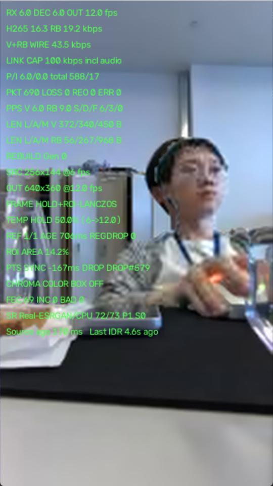
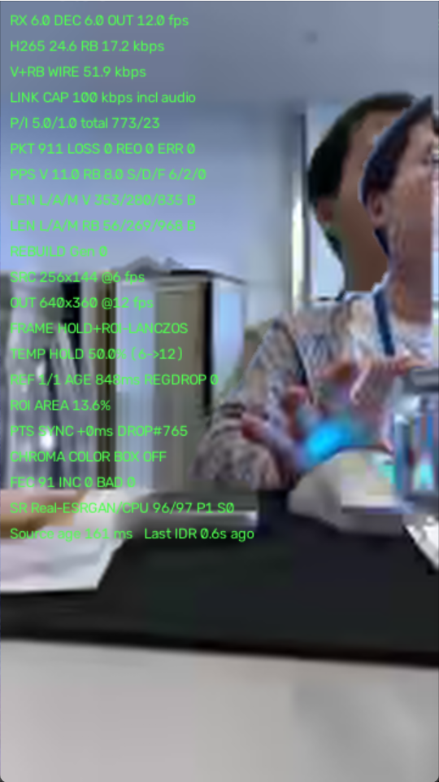

## 一、方案落实情况：6 条全部改了

| 方案                                        | 状态 | 代码                                                       |
| ------------------------------------------- | ---- | ---------------------------------------------------------- |
| 1 参考时效 2000→700ms，max-age 3.0→1.0      | 已改 | `config.cc:33`、`live_h265_hud.py:498`                     |
| 2 传 reference_bbox，做相似变换配准         | 已改 | `rebuild_sender.cc:451-468`、`rebuild_receiver.py:634-676` |
| 3 alpha 0.84 → distanceTransform 羽化到 1.0 | 已改 | `rebuild_receiver.py:615-622`                              |
| 4 失配闸门（位移 25% / 面积比 0.7~1.4）     | 已改 | `rebuild_receiver.py:655-663`                              |
| 5 PTS 窗口 250→100ms + 线性外推             | 已改 | `rebuild_receiver.py:246-281`                              |
| 6 掩膜 32→64，无分割时用框而非全 255        | 已改 | `rebuild_sender.cc:398-427`                                |

粗暴的"两张脸"确实消失了。剩下的问题是**一个回归 + 三个原方案没覆盖的根因**。

## 二、抖动的主因：96% 的帧根本没贴 ROI

这是最重要的一条，两张截图都能算出来：

- test1：`total 588/17` = 605 帧解码，`DROP#579` → **95.7% 的视频帧被 PTS 门拒绝**
- test2：`total 773/23` = 796 帧，`DROP#765` → **96.1%**

也就是说合成器绝大多数帧输出的是纯 Lanczos 底图，只有约 4% 的帧贴上了 patch。人脸在"糊底图"和"贴片"之间以不规则频率跳变——这就是你看到的抖动，不是运动抖动，是**开关抖动**。

### 为什么 96% 被拒？PTS 有一帧的系统性偏移

test1 显示 `PTS SYNC -167ms`，而 6 fps 一帧正好是 166.7 ms。这不是抖动，是恒定偏移。根因在 `live_h265_hud.py:569`：

```python
latest.put(frame, decoded_pts.pop())
```

`DecodedPtsQueue.pop()` 取的是 **items[-1]，即最新压入的时间戳**（`live_h265_hud.py:366-372`）。压入发生在 AU 被喂进 ffmpeg stdin 时（`:660`），而 BMP 从 ffmpeg 出来要晚一帧。于是第 N 帧的图像被贴上了第 N+1 帧的时间戳 → 视频时间戳恒定超前一帧 → 正确对齐的 STATE 看起来永远慢 167 ms。截图里 `Source age 170 ms` 印证了这一帧的管线延迟。

那个 docstring 的理由（避免丢 AU 后永久滞后）成立，但它把"偶发滞后"换成了"恒定超前"。之前 250 ms 的窗口能容忍 167 ms，收紧到 100 ms 后就全被毙掉了。

### 外推逻辑救不了任何一帧

`_extrapolate_state` 里有两处互相抵消的设计：

```python
if sample_delta <= 0 or abs(offset) > max_sync_ms or sample_delta > 2000:
    return selected        # :262 — 偏移超窗时直接放弃外推
...
if (... or abs(selected_delta) > self.max_sync_ms):   # :330 — 用外推【前】的 delta 判门
```

外推在偏移大于窗口时自己退出，而闸门又用未外推的原始 delta 判断。结果：**外推只能微调那些本来就能通过的帧，一帧都救不回来**。offset=167、窗口=100 时它完全不工作。

## 三、ESRGAN 完全失效（回归，由几何修复引入）

两张截图都是 `FRAME HOLD+ROI-LANCZOS`，同时 `SR 72/73 P1` / `SR 96/97 P1` —— 推理几乎全部完成，却一次都没被用上。

原因在 `rebuild_receiver.py:575`：

```python
key = (reference.generation, reference.track_id,
       reference.reference_generation, size[0], size[1])
```

key 里含 `size`。改造前 size 由 `reference.crop × 固定 scale` 得出，是常量；改造后 `_registered_crop` 把 size 挂到了**当前检测框**上（`:668-672`），YOLO 框每帧抖几个像素，size 就每帧变 → **cache 永远 miss** → 每帧提交一个新 SR 任务、算完立刻作废、下一帧重算。`S0`（stale=0）说明上次那个作废统计已经修好了，但换成了一种更浪费的形式：算完了，缓存了，没人查得到。

73 次 CPU 推理换来 0 次使用。修法：key 只用 `(generation, track_id, reference_generation)`，缓存模型原生 x2 输出，贴图时再 Lanczos 缩到当前尺寸。

## 四、残余重影：HUD 的 AGE 少算了传输时间

`REF 1/1 AGE 706ms` 里的 AGE 是 `now - reference.received_at`（`rebuild_receiver.py:292`），从**收齐那一刻**算起，不是从拍摄那一刻。

实际传输耗时：2600 B 的 JPEG + 64x64 掩膜 RLE，按 `patch_chunk_bytes=900` 切成约 3 个数据包 + 1 个校验包，而 `sendPendingReferencePacket` **每个源帧只发一个包**（`rebuild_sender.cc:614-619`）。6 fps 下 4 个包 = **约 670 ms**。

所以真实内容年龄 ≈ 706 + 670 ≈ **1.4 秒**，test2 是 848 + 670 ≈ **1.5 秒**。`patch_refresh_ms=700` 这个设置实际上达不到——传输本身就要 670 ms，刷新周期被传输时间卡死了。贴上去的仍然是 1.5 秒前的脸。

而 `REGDROP 0` 说明几何闸门一次都没拦住：**人转头时框不变、面积不变、中心不变**，位移/面积比闸门对"姿态变了但框没变"完全无感。test2 那个半透明的重影头就是这种情况。

## 五、抖动的第二来源：各向异性缩放

`_registered_crop`（`:668-672`）用 `cur_width` 和 `cur_height` **独立**缩放 x 和 y。256x144 上 YOLO 框抖 2 px，映射到 640x360 就是 5 px，而且宽高比每帧都在变（人抬手会改变框宽但不改变头）→ 贴片每帧被非等比拉伸一次，脸在"呼吸"。应该用等比缩放（取 `sqrt(面积比)` 或只用高度），再对框做 EMA 平滑。

另外 64x64 掩膜放大到约 300 px 是 5 倍，量化台阶就是 5 px，而 `distance / 4.0` 的羽化只有 4 px（`:622`），盖不住台阶，边缘仍有阶梯状硬边。

## 六、修复优先级

1. **标定并扣除 PTS 系统偏移**（收益最大）。用滑动中位数估计 `selected_delta` 的直流分量并扣除，再用外推补残差；闸门改用**外推后**的残差判断，`_extrapolate_state:262` 的 `abs(offset) > max_sync_ms` 提前退出要放宽到比如 400 ms。目标是把 DROP 率从 96% 压到 10% 以下。这一条不修，后面所有画质改进都看不到。
2. **SR 缓存 key 去掉 size**，缓存原生 x2 结果。
3. **加内容配准**：贴之前把 patch 降到底图分辨率，用 `cv2.matchTemplate` 在底图邻域做 ±8 px 搜索，用峰值位置修正偏移、用峰值相关度做闸门（低于阈值就不贴）。这是唯一能同时治重影和抖动的手段——它把贴片锁在**底图真实像素**上，而不是锁在有噪声、有延迟的检测框上。也只有它能拦住"框没变但脸转了"这种情况。
4. **年龄闸门改用 `video_pts - reference.pts_ms`** 而不是 `now - received_at`，HUD 两个都显示，避免再被 AGE 误导。
5. **压缩参考传输时延**：`patch_max_bytes` 2600→1600 或 `patch_chunk_bytes` 900→1200，让一次参考 2 个包发完（约 330 ms）；带宽还有 50 kbps 余量（当前 `V+RB WIRE 43.5/100`），也可以允许一帧连发 2 包。
6. 框做 EMA + 等比缩放；羽化半径按掩膜放大倍数自适应。

第 1、2 条是修 bug，改动很小；第 3 条是补方案原本缺的一环——**框驱动的配准有物理上限，最终必须靠内容驱动**。