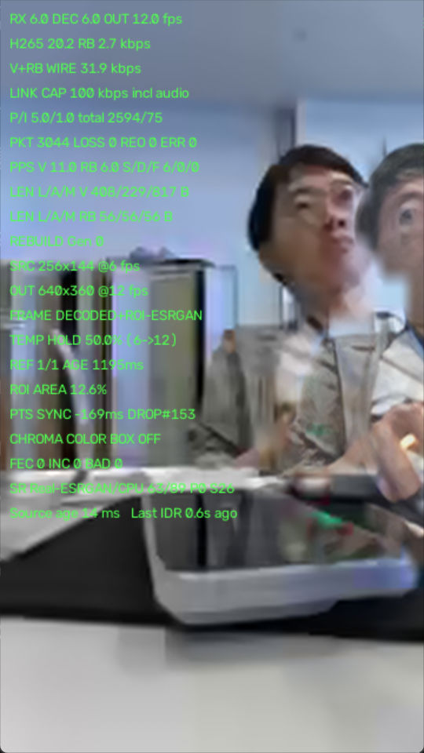

我读了截图和收发两端的代码（`tools/rebuild_receiver.py`、`cpp/transport/rebuild_sender.cc`），结论如下。

## 一、重影不是解码/编码问题，是合成器的配准问题

截图里的关键证据是 **`REF 1/1`** —— 只贴了 **一个** 参考块，画面上却有 **两张脸**。所以左边那张（糊的）是 H.265 底图里的人，右边贴边那张（相对锐的）就是 RB/1 贴上去的 JPEG patch。两者错位了大约一个头宽，这就是重影。

底图和 patch 是两条独立的、时间和几何都没有对齐的通路：

| 通路        | 内容                           | 时效                      |
| ----------- | ------------------------------ | ------------------------- |
| H.265 基带  | 256x144 @6fps，20.2 kbps，整幅 | 当前帧                    |
| RB/1 STATE  | 目标框（source 坐标）          | 截图里比底帧**旧 169 ms** |
| RB/1 参考块 | ≤128px 的 JPEG + 32x32 掩膜    | 截图里 **1195 ms 前**     |

合成器 `RebuildComposer.render()` 做的事是：**用 1.2 秒前的像素，按 169 ms 前的框中心，贴到当前底帧上**。目标一动，必然双影。

### 具体成因，按贡献排序

**1. 参考块过期，且贴图位置只跟框、不跟底图内容**（`rebuild_receiver.py:589-596`）

```python
crop_width  = (reference.crop[2] - reference.crop[0]) * scale_x   # 旧尺寸
center_x    = (target.left + target.right) * 0.5 * scale_x        # 新中心
```

- 尺寸取自**参考块生成时**的裁剪框，中心取自**当前**目标框。人走近/走远导致框变大变小时，patch 尺寸不变 → 大小对不上，底图的脸从贴片边缘漏出来。
- 发送端每个 track 的参考刷新间隔是 `patch_refresh_ms = 2000`（`cpp/common/config.cc:33`），而且是**限速下逐包发**（`patch_chunk_bytes=900`，一帧发一包，见 `rebuild_sender.cc:568-580`），一次参考实际要 0.5～1 s 才送完。接收端 `--rebuild-reference-max-age` 默认还给到 **3.0 s**（`live_h265_hud.py:498`）。所以贴上去的脸普遍是 1～3 秒前的姿态。

**2. alpha 上限 0.84，底图永远透出来**（`rebuild_receiver.py:550`）

```python
alpha = np.clip(alpha * 0.84, 0.0, 0.84)[:, :, None]
```

即使配准完美，掩膜内也永远混着 16% 的底图。配准不完美时，这 16% 就是字面意义上的"第二张脸"。这是重影最直接的来源——它是设计成双曝光的。

**3. 掩膜只有 32x32 二值**（`rebuild_sender.cc:399` `mask_side = 32`）

一张脸在输出里约 250x300 px，用 32x32 掩膜 INTER_LINEAR 放大 + 小核高斯羽化，一个掩膜格子≈8-10 输出像素。轮廓是块状的，会连带把参考块里的**旧背景**一起贴上来，在人物周围形成一圈方块状的幽灵边。

**4. 裁剪框在画面边缘被 clamp，接收端却当作对称**（`rebuild_sender.cc:355-358`）

发送端裁剪是 `bbox ± 20% margin` 再 clamp 到画幅内；人靠近右边缘时右侧 margin 被截掉，bbox 在裁剪块里**不再居中**。接收端却把裁剪块中心对齐到目标框中心 → 额外产生最多 margin/2（约框宽 10%）的水平偏移，方向正好是往边缘推。截图里 patch 贴在右边缘，符合这个特征。协议里没有传"bbox 在 crop 内的位置"，接收端无从补偿。

**5. PTS 同步窗口太松**：`--rebuild-max-sync-ms` 默认 250 ms（`live_h265_hud.py:499`），而 6 fps 的一帧才 167 ms。窗口允许 1.5 帧的位移误差通过。

**6. 附带发现：ESRGAN 大部分白跑了**。HUD `SR ... 23/89 P0 S28` = 提交 89 个任务、完成 23、作废 28。`_poll()` 里结果如果不在 `valid_keys` 就直接丢弃且**不入缓存**（`rebuild_receiver.py:496-499`），下一帧同一个 key 又重新提交，形成循环重算。后果是同一张脸在 Lanczos 版本和 ESRGAN 版本之间来回跳，视觉上是"软—锐"脉动，会被当成另一种重影。

### 修的优先级

链路预算还有大量余量：`V+RB WIRE 31.9 kbps / LINK CAP 100 kbps`，其中 RB 只占 **2.7 kbps**。所以最有效的一步几乎是免费的：

1. **降低参考时效**：`rebuild-patch-refresh-ms` 2000 → 600~800，`--rebuild-reference-max-age` 3.0 → 1.0。单目标下即使 2600 B / 0.7 s ≈ 30 kbps，仍在预算内（可配合 `rebuild-max-targets=1`）。
2. **改用相似变换而非"旧尺寸+新中心"**：协议里补一个"参考块生成时的 bbox"字段，接收端按 `参考bbox → 当前target bbox` 做缩放+平移，顺带解决 clamp 不对称和目标缩放两个问题。
3. **alpha 提到 1.0**：掩膜腐蚀后的核心区域 alpha=1.0（完全替换），只在边缘 3-5 px 羽化到 0。保留 0.84 就等于保留重影。
4. **加一个失配闸门**：若当前框与参考框的中心位移 > 框宽的 25%，或面积比超出 [0.7, 1.4]，本帧就不贴，只出底图。宁可退化成 Lanczos 底图，也不要双影。
5. **收紧 PTS 窗口**到 80~100 ms，并在 STATE 里做线性外推补足到底帧时刻。
6. 掩膜 32x32 → 48 或 64（RLE 后增量很小）。

## 二、Real-ESRGAN 应该超分 ROI，不是全图

**现在的做法（只超分 ROI）是对的，不要改成全图。** `SuperResolver` 的注释已经写明了这个立场（`rebuild_receiver.py:354`），理由成立：

1. **信息量**。全图超分的输入是 20 kbps 的 256x144 H.265，细节在编码时就已经销毁了，ESRGAN 只能凭先验编造，而且会把块效应和振铃当成结构放大。ROI patch 是一条**独立的 JPEG 通路**（q72，独立于 H.265 码流），携带的是基带里根本没有的真实信息——超分在这里才有东西可放大。这一点与 `增强.md` 里的判断一致：接收端增强无法恢复发送端编码时已丢失的信息。
2. **算力**。HUD 显示 CPU 版 ESRGAN 处理 ≤128px 的小块都已经 23/89 跟不上；全图 256x144→512x288 的像素量是 128x128 块的约 4.5 倍，12 fps 下 CPU 上不可能实时。
3. **反效果**。全图超分会把底图整体锐化，两张都清晰的脸叠在一起，比"一清一糊"更刺眼——它会**放大**重影的可见度，而不是掩盖。

全图这一层该用的是廉价确定性算子，也就是现在这套：Lanczos4 + 轻度双边去噪（`--denoise on`），最多再加轻锐化/CLAHE。

不过当前 ROI 超分链路本身有两个值得修的点：

- **`ESRGAN x2` 之后又 Lanczos 二次缩放**（`rebuild_receiver.py:450-451`）：128px 的块 x2 得到 256，而目标显示尺寸常常在 250~350 之间，于是又被 Lanczos 重采样一次，把超分收益抹掉一部分。应该让 `patch_max_side` 与输出目标尺寸对齐（例如按目标尺寸/2 反推裁剪块的下采样尺寸），避免 SR 后再缩放。
- **结果丢弃后不入缓存**导致的重复计算和软/锐跳变，见上面第 6 点。

最后一句判断：**超分解决不了重影**。重影是几何配准和时序对齐的问题，先修第一部分的 1、2、3、4，再谈画质增强——否则只是把一个错位的幽灵变得更清晰。